# HireLoop — post once, hire anywhere

**Team vibe** · Madni Munnay · Ahmed Malik · Maimoona Islam
Built for the *Build with Fastn* hackathon · Track 04, Cross-Platform Publisher

**Live: https://hireloop-lilac.vercel.app** · [Desktop companion](https://github.com/ahmedmalik07/dexterity_fastn/releases/tag/v1.9.0) · [Source](https://github.com/ahmedmalik07/dexterity_fastn)

---

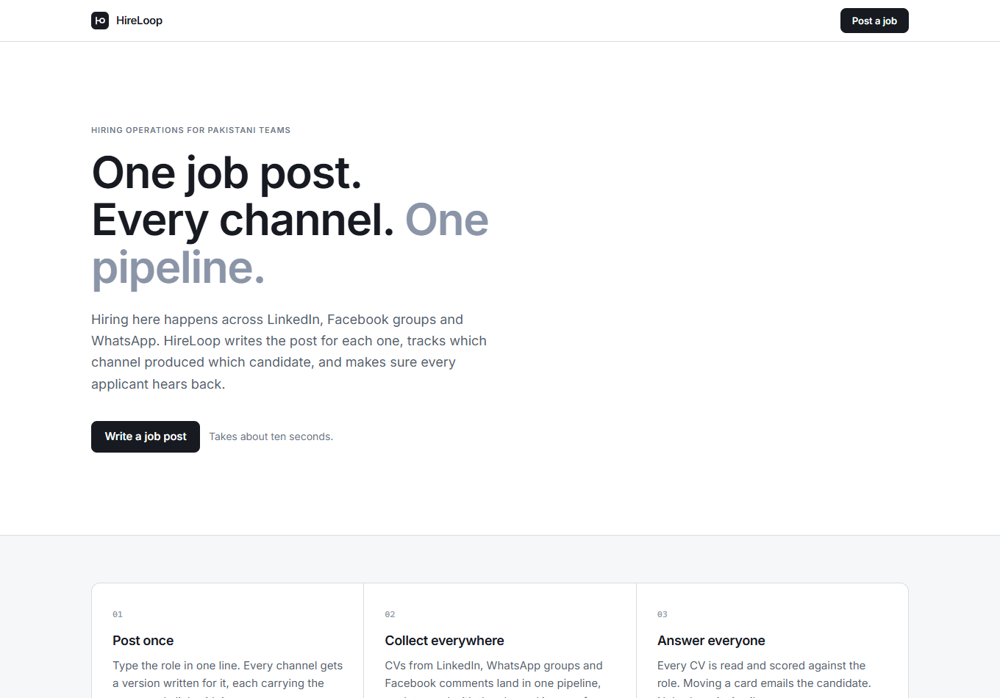

## The problem, from a real office

An HR person in Islamabad opens a job. Then they write it five times — once for
LinkedIn, once for a Facebook group, once for WhatsApp, once for X, once for a Discord
server. Five different tones, five different lengths.

Then the CVs arrive: some by email, some as WhatsApp attachments, some as a comment under
the Facebook post, some as a LinkedIn DM. Nobody knows which channel produced the good
ones. And most applicants never hear anything at all.

That last part is the one that stings. **Not rejection — silence.**

HireLoop fixes all three: write once, collect everywhere, and answer everyone.

---

## 1. One line in

You type the role the way you'd say it out loud.

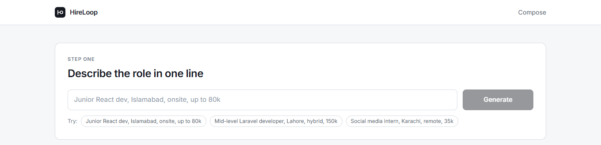

That's the whole input. `Junior React dev, Islamabad, onsite, up to 80k`.

## 2. A real job post out — five ways

Eight seconds later there's a full job description *and* a version written for each
platform. Not the same text pasted five times: LinkedIn gets a professional tone,
Facebook gets Roman Urdu mixed with English because that's how Pakistani job groups
actually talk, WhatsApp gets something short enough to forward.

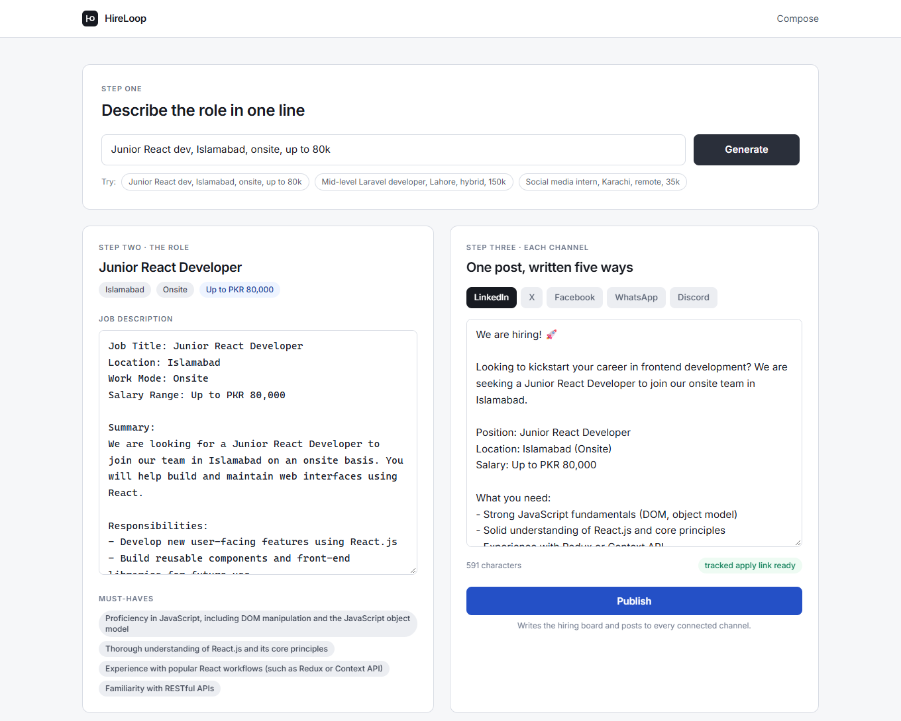

Every version carries the same apply link with a **different `src` tag** — so when a CV
arrives, the pipeline already knows which channel it came from. That's the whole trick
behind the analytics later.

## 3. Publish, and be honest about it

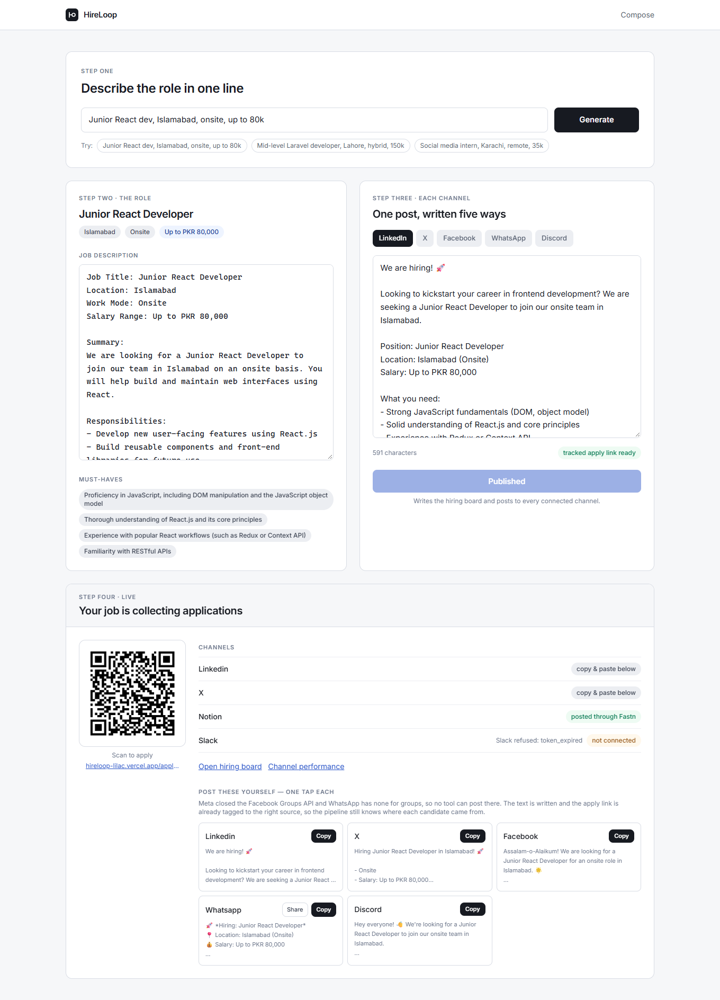

Look at the **Channels** list — this is the part we're most proud of, and it's the part
most demos would hide.

| Channel | What really happens |
|---|---|
| **Notion** | Posted through Fastn. A real row on the hiring board. |
| **Slack** | Posted through Fastn when the token has `chat:write`. |
| **LinkedIn, X** | **Not posted.** Fastn has no connector for either, and we have no developer tokens. The text comes back written, one tap to copy. |
| **Facebook, WhatsApp** | **Nobody can post here.** Meta closed the Groups API; WhatsApp never had one. |

We could have faked those last two rows. We'd rather show you the table.

Here is the row that "posted through Fastn" actually produced, in Notion — the job
description, the must-haves, the tracked apply link, and `Status: Live`:

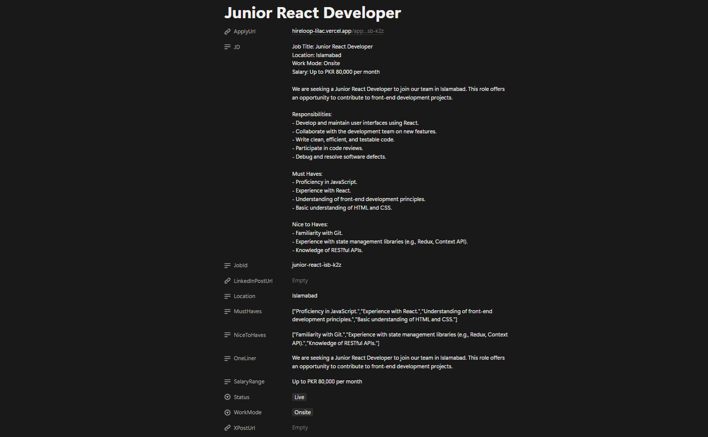

And that big QR code? That's the demo. Point a phone at it.

## 4. Applying, from a phone, in under a minute

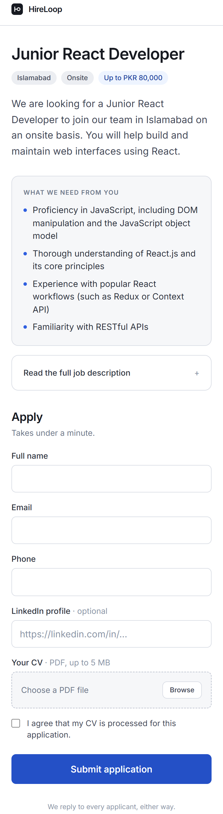

Name, email, phone, CV, consent. That's it. The page is built mobile-first because
that's how people actually apply here — standing in a queue, on a phone, on patchy data.

Behind the scenes, in the seconds after they hit submit:

1. The CV is stored
2. The PDF text is extracted — and if it's a scanned image with no text, it says so
   rather than crashing
3. The CV is scored against *this job's* must-haves
4. A card appears on the hiring board
5. The applicant gets an email saying we've got it

The applicant never sees their score. That's for the hiring team.

## 5. The scoring, and what we told it not to do

The scorer is given explicit instructions to **ignore name, gender, age, photo, religion,
marital status, university prestige and city of origin**, and to credit a skill only when
the CV shows evidence of it — a job, a project, a repo.

Real output from the five test CVs against "Junior React Developer":

| Candidate | Score | Verdict | Why |
|---|---|---|---|
| 2 years React, Next.js, TypeScript | **95** | Strong | Production React, performance work, real projects |
| React Native + web, portfolio | **90** | Strong | Shared TypeScript layer across app and web |
| Strong HTML/CSS/JS, little React | **60** | Maybe | Solid fundamentals, no practical React yet |
| 4 years Java / Spring Boot | **15** | Weak | Experienced — but no frontend for this role |
| Scanned, image-only PDF | **0** | Maybe | *"CV could not be read, review manually"* |

That last row matters. A scanned CV is a **human review flag**, never a silent rejection.

And this is where they land — the hiring board in Notion, every row written through
Fastn. The CV link, the AI's reasoning, the channel each candidate came from, and the
stage they were last told about:

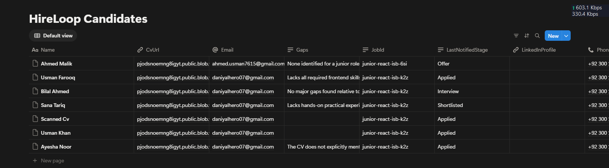

Read the `LastNotifiedStage` column: Offer, Interview, Shortlisted, Applied. That column
is what stops a candidate being emailed the same news twice.

## 6. Which channel actually hires for you

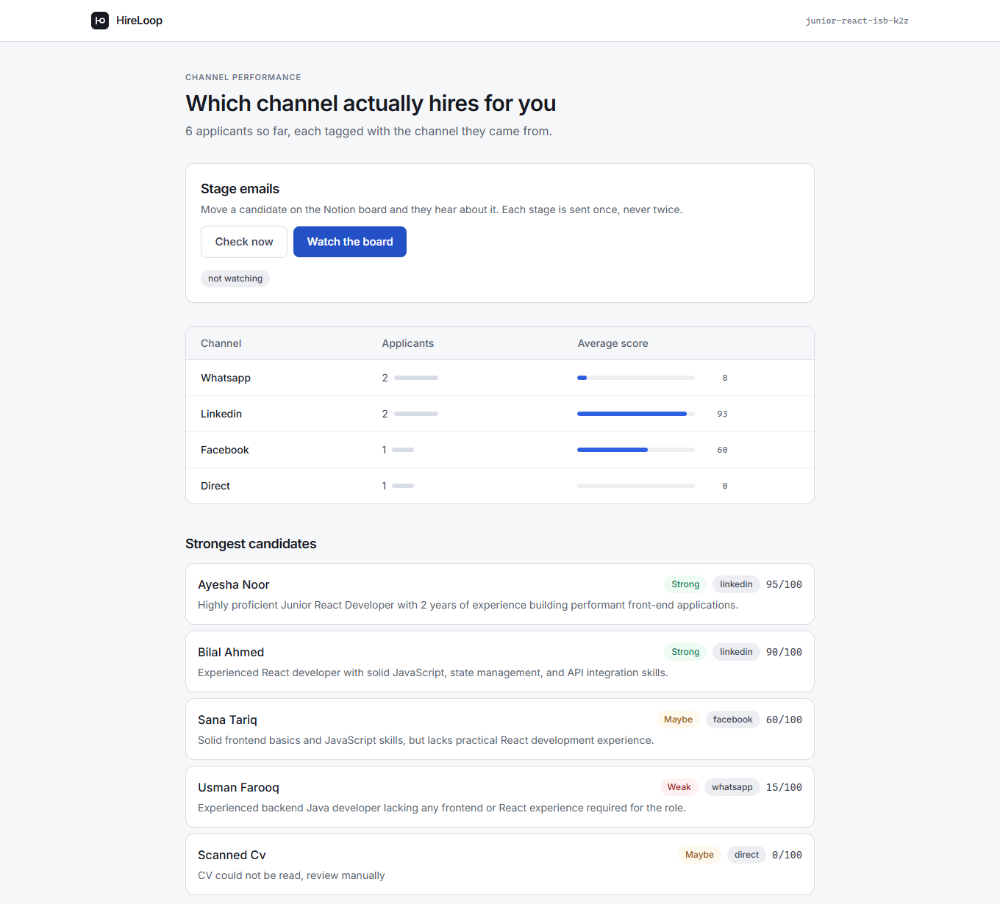

Applicants per channel, and the average score per channel. This answers the question no
HR team in Pakistan can currently answer: *is the Facebook group worth the effort, or is
LinkedIn carrying everything?*

## 7. Nobody gets ghosted

Move a card on the Notion board and the candidate hears about it — shortlisted,
interview, offer, or a rejection written like a person wrote it.

Each stage sends **exactly once**. The board records what was last sent, so dragging a
card twice doesn't email twice.

Here is a real inbox after a candidate moved through the pipeline — received, shortlisted,
interview invitation:

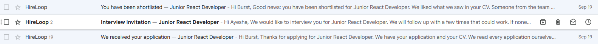

And one of them opened. No template variables left showing, no corporate filler:

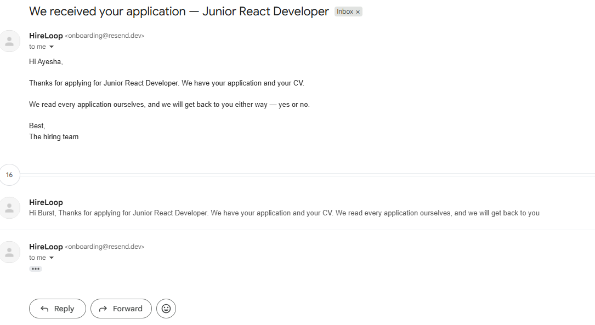

---

## The channels nobody can reach

Here's the thing that makes this more than a posting tool.

The channels that matter most in Pakistani hiring — WhatsApp groups, Facebook groups,
DMs — have **no API for anyone**. Not for us, not for Fastn, not for a company with a
hundred engineers. So a CV that arrives in a WhatsApp group is invisible to every
recruiting tool on the market.

Unless you just look at the screen.

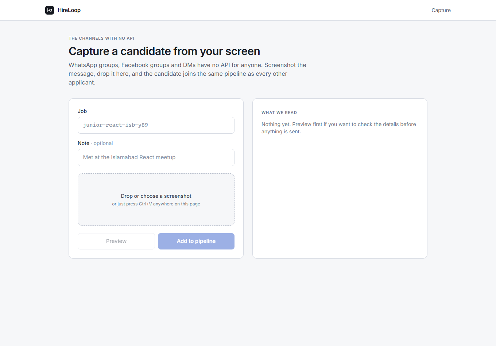

Screenshot the WhatsApp message, drop it in, and the candidate joins the same pipeline as
everyone else. We tested it with a mock group chat and it pulled out:

```
Hira Saeed · hira.saeed@example.com · +92 333 4455667
linkedin.com/in/hira-saeed-dev · channel: whatsapp · confidence: high
```

> **Fastn connects every app that has an API. We added the ones that don't.**

---

## The desktop companion

The web app is one way in. The other is **Dexterity** — a Windows companion that sits
beside your cursor, sees your screen, and helps without you leaving what you're doing.

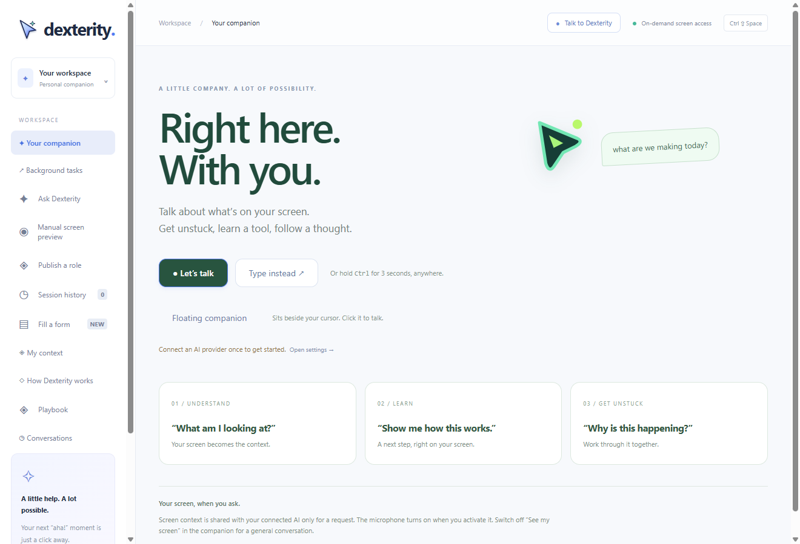

The point: you shouldn't have to screenshot your work into ChatGPT and retype the
question. It's already there.

### Publish a role, from inside your work

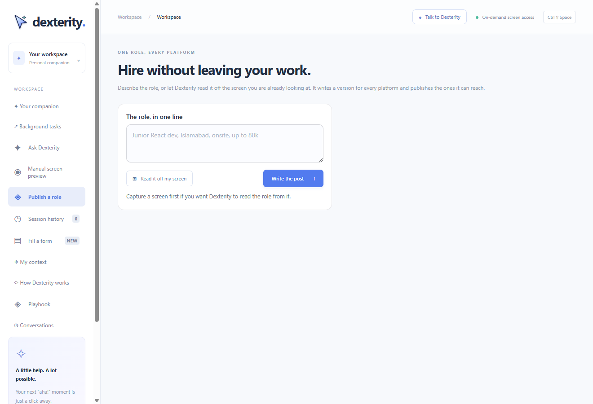

You're in a Slack thread where the team agrees to hire someone. You don't retype
anything — you press **Read it off my screen**.

We gave it a real Slack hiring thread and it produced:

```
Junior React dev, Islamabad, onsite, up to 80k PKR per month
```

Then the same engine writes the post and every platform version:

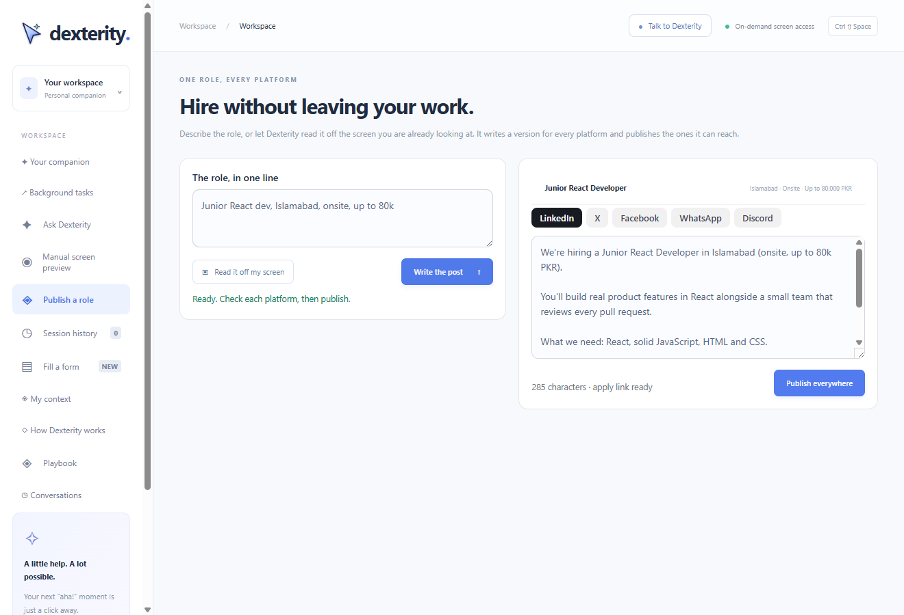

Including the Facebook version, in the register those groups actually use:

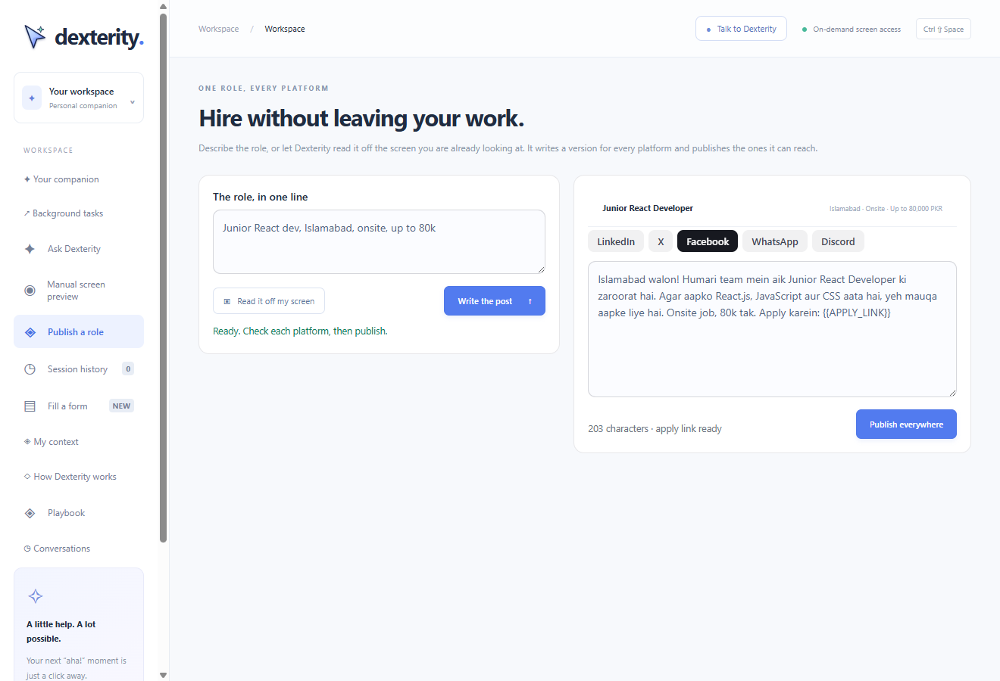

And publishing reports the same honest per-channel truth as the web app:

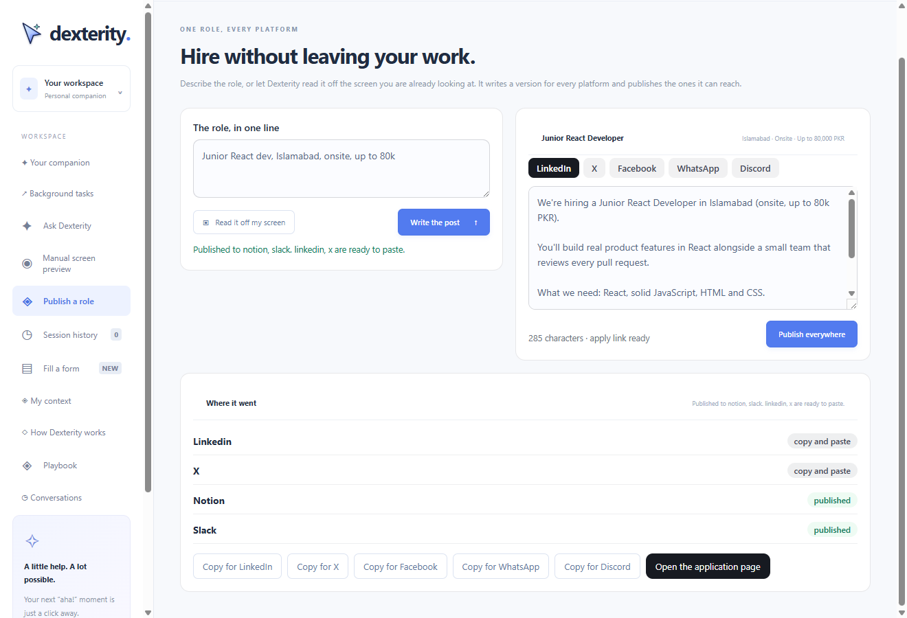

### It fills forms, with your own details

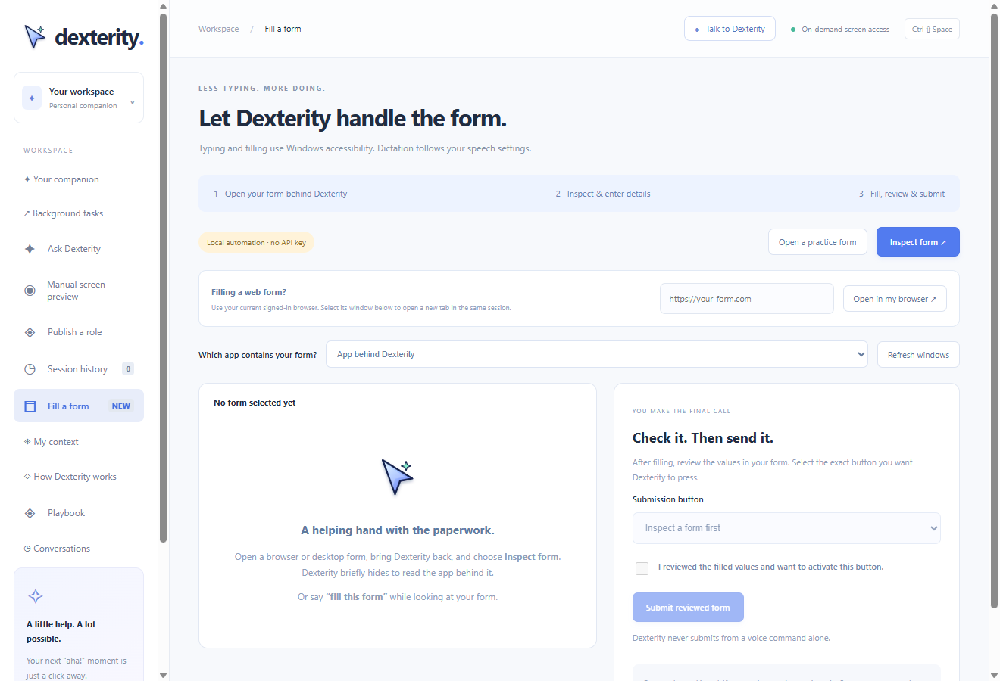

Point it at a form — Google Forms, a job application, an internal portal — and it reads
the fields, fills them from your saved context, and stops.

It will **not** submit on its own. You pick the button and tick a confirmation first. And
it never touches a password field.

We proved this against a real Chrome window with a local server capturing the result:

```
PASS: the browser window is visible to Dexterity — Google Chrome
PASS: read the form — ["Full name","Email address","Phone number"]
PASS: the password field was excluded
PASS: filled the real page in Chrome, and nothing was submitted yet
PASS: server received {"fullname":"Ahmed Malik","email":"ahmed@example.test",
                      "phone":"+92 300 1234567","secret":""}
```

Note `secret` is empty. That's the password field, deliberately untouched.

### It teaches, on the screen you're stuck on

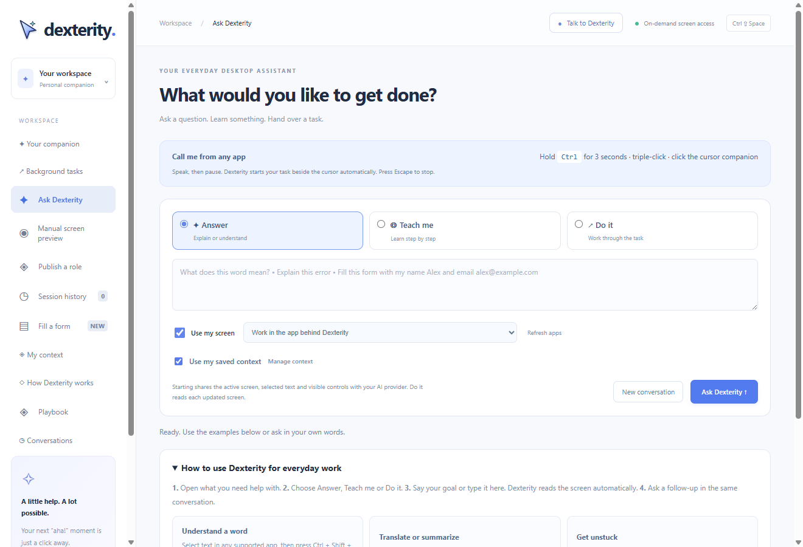

We gave it a DaVinci Resolve screenshot and asked real questions:

| Question | Answer |
|---|---|
| "How do I colour grade this clip?" | "Switch to the **Color** page" ✓ |
| "Where do I change the audio level?" | "Select the music clip, open the **Inspector**" ✓ |
| "How do I export as MP4?" | "Switch to the **Deliver** page" ✓ |

It can also point at where to click. Those markers are model-proposed, not pixel-perfect —
the words are reliable, the arrow is a hint.

---

## How Fastn is actually used

This is the part that matters for the track, so here it is plainly.

**The app holds no Notion token, no email key, no Slack token.** Every one of them lives
in a Fastn connection. Our repo is public and leaks nothing.

The Notion side of that is a single integration, granted read and write on one workspace:

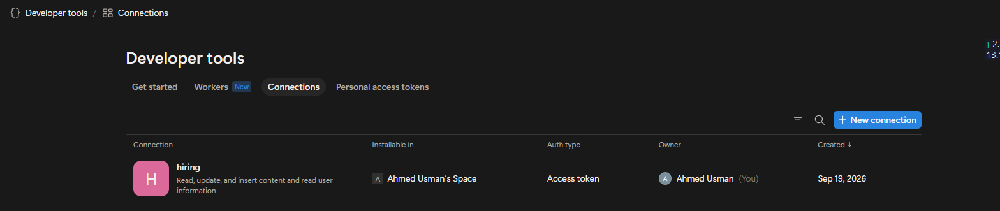

Three connectors are in play:

| Connector | Why |
|---|---|
| `HTTP API` (built in) | Slack and X — a bearer token is all they need |
| `HireLoop Notion` (custom) | Notion also needs a `Notion-Version` header, which the generic connector can't send |
| `HireLoop LinkedIn` (custom) | LinkedIn needs `X-Restli-Protocol-Version: 2.0.0` |
| `HireLoop Email` (custom) | Transactional email, one connection, no ambiguity |

We built the custom ones programmatically against `api.fastn.dev/api/v1` — connector,
auth method, actions and connection, all from code.

### And then it runs without us

The stage emails aren't driven by our app at all. They're a **Fastn workflow running on
Fastn's infrastructure**:

```
hireloop-stage-notifier   wf_c55a11b8f31f   */5 * * * *   Asia/Karachi
```

Every five minutes: read the board through a Fastn connector, email whoever moved, write
the stage back. **No browser open. No server of ours. No cron on a laptop.**

Vercel's free plan refuses a per-minute cron. Fastn just runs it. That's the honest
answer to what Fastn is for — **it replaces the backend you'd otherwise build, host and
pay for.**

Proof from a live run:

```
move a card to Offer  →  {"sentCount":1,"sent":[{"name":"Ahmed Malik","stage":"Offer","ok":true}]}
run it again          →  {"sentCount":0}
```

Sent once. Never twice.

---

## Two things we learned the hard way

**Fastn's `{{input.body}}` drops nested objects.** A generic pass-through action silently
lost the Notion `parent` field, so every "successful" write created a loose page in the
workspace instead of a row on the board. Everything reported success. Use an explicit
`bodyTemplate` per action.

**A scheduled tick arrives with no input.** Our first workflow read `ctx.input.candidatesDb`,
which is fine when you call it by hand and fatal on a cron — it would have failed every
five minutes forever while looking perfectly armed.

---

## What's real, and what isn't

| | Status |
|---|---|
| Job post generation, 5 platform versions | Working |
| Tracked apply links per channel | Working |
| Notion hiring board | Working, through Fastn |
| CV parsing and scoring | Working |
| Candidate email, any address | Working, verified domain |
| Stage emails on a 5-minute schedule | Working, on Fastn |
| Screen capture for API-less channels | Working |
| Desktop companion: publish, forms, teaching | Working |
| **LinkedIn / X posting** | **Not working** — no Fastn connector, no developer tokens |
| **Facebook / WhatsApp groups** | **Impossible** — the APIs don't exist |

---

## Running it yourself

```bash
git clone https://github.com/ahmedmalik07/dexterity_fastn
cd dexterity_fastn/app && npm install && cp .env.example .env.local
```

Add `GEMINI_API_KEY` and `FASTN_API_KEY`, then wire the services up:

```bash
node scripts/fastn.mjs connect notion <notion-integration-token>
node scripts/fastn.mjs connect email  <resend-api-key>
node scripts/fastn.mjs init-notion    <notion-parent-page-id>
```

Put the two printed database ids in `.env.local` and run `npm run dev`.

The desktop companion:

```bash
cd ../dexterity && npm install && npm start
```

### Tests

```
61 unit · companion · voice · coach · context · tasks · desktop · native · forms
publish-ui · browser-form · hireloop bridge
```

All passing. The browser-form suite drives a real Chrome window; the publish-ui suite
drives the real Electron app.

---

**Team vibe** — Madni Munnay, Ahmed Malik, Maimoona Islam
