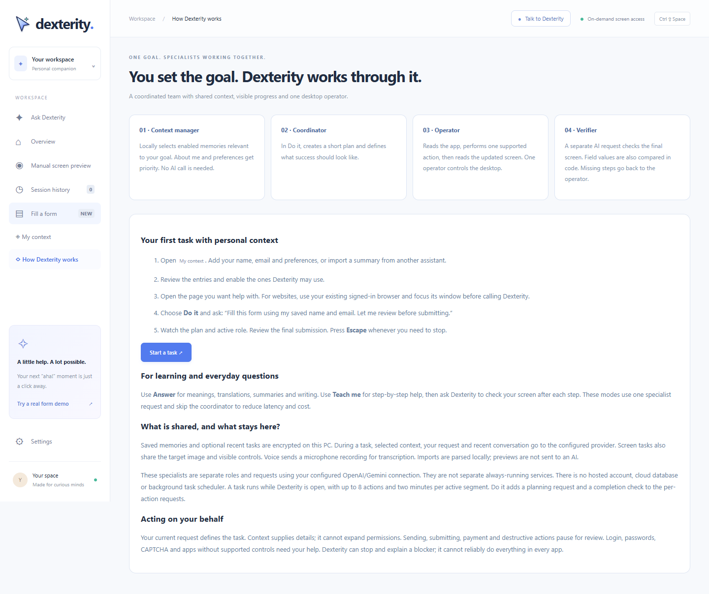
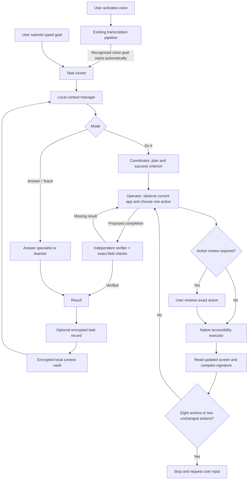

# Dexterity 1.7 architecture

*Current-interface preview with sample data. See the [product gallery](docs/GALLERY.md) for the other surfaces.*

Dexterity is a Windows desktop application with durable personal context and a coordinated agent workflow. The Electron main process owns credentials, persistence, provider requests, cancellation and native actions. Sandboxed renderers show the UI and communicate through narrow preload methods. A C# helper exposes Windows accessibility controls; only the operator can request actions through the task runner.

The cursor lesson surface (`electron/coach.cjs`, `ui/coach.*`) displays a single teaching step outside the dashboard, requests fresh observations for continuation, and keeps the original goal. The model can return a normalized screenshot target; the main process converts it to display coordinates and draws a click-through overlay. Pointer targets expire and native window title/bounds are checked before redisplay. A pointer is advisory, never an automatic click.

OpenRouter is the primary provider whenever its key is saved. Screen requests ask for Gemini 2.5 Pro and pass a fallback list, so OpenRouter serves 2.5 Flash and then Flash Lite when the chosen model is unavailable or rate limited; the served model is read back from the response and reported to the interface rather than assumed. Microphone transcription uses Flash Lite and sends no fallback list, so a voice request can never be silently upgraded to a reasoning model. Remaining OpenRouter errors surface directly rather than silently switching to a separate direct-provider account. Without OpenRouter, the existing direct OpenAI/Gemini fallback applies.

A build may ship a demo credential in `electron/bundled-key.cjs`. That file is excluded from Git and appears in no commit, so the key is never published with the source, but it is packaged into the executable and can be extracted from it. It is only a default: a key saved in Settings replaces it, and automated test runs ignore it entirely so tests never reach a live provider. Keys saved by the user are Windows-encrypted outside the repo.

Each provider response carries its token counts through to the runner, which totals requests, tokens and elapsed time per task and estimates a price from a small table of published per-token rates in `electron/core.cjs`. A model with no published rate reports tokens and no price rather than a guessed one.

The activated recorder runs Silero V5 locally with ONNX Runtime Web. All model, worklet and WASM assets are copied from pinned npm dependencies at installation; its CSP permits only local assets and WASM compilation. Speech must pass the detector threshold and minimum duration. No-speech recordings stop at six seconds without upload. Speech ends after the selected silence duration, with a 15-second hard cap in both the renderer and a main-process watchdog. Microphone tracks stop before transcription. Noise suppression/echo cancellation are enabled, automatic gain disabled. The detector does not identify the user's voice versus another speaker.

After transcription, the renderer starts a companion task against the app remembered at voice activation. It does not open the dashboard or require Run. The recorder and transcription provider pipeline are unchanged. Recognized cancel/stop commands start no task; manual form-field dictation keeps its existing field-editing flow. The dashboard opens when a running task needs explicit action approval. The runner checks the action count before execution; native code independently enforces the protected-control review rule.

| Voice task stage | Visible behavior |
| --- | --- |
| Activated recording and transcription | Small listening surface; microphone stops before transcription. |
| Recognized task starts | Companion progress; no dashboard opening or second submission. |
| Protected action | Dashboard shows the exact action for explicit approval. |
| Completion, blocker, or action limit | Companion result or handoff; no silent task restart. |

Voice uses the window remembered at activation. Typed tasks may use the dashboard's explicit window selection. The screen-sharing preference remains respected in both flows; automatic voice startup does not turn it on when disabled.

## Roles and contracts

| Component | Implementation | Responsibility |
| --- | --- | --- |
| Context manager | `electron/context-store.cjs` | Local keyword retrieval over enabled entries, with profile/preference priority. At most 8 records / 16,000 text characters. No embedding or extraction API cost. |
| Coordinator | `electron/team.cjs` | One structured AI request per Do task; returns summary, 1–6 steps and observable success. Cannot execute. |
| Operator / teacher / answer specialist | `electron/agent.cjs` | Mode-specific structured request. Operator returns exactly one supported action against the current observation. Explanation modes cannot execute. |
| Verifier | `verifyTask` in `electron/agent.cjs` | Separate provider request checks completion; requested text field checks are compared against current values in code. Can return missing steps. Its verdict is written to the visible action log as a pass or fail row before the runner continues. |
| Task runner | `electron/task-runner.cjs` | Owns cancellation, role events, plan, progress, memory snapshot, review, bounded loop and last-six-exchange conversation. |
| Native executor | `native/Dexterity.Native.cs` | Windows UI Automation actions against short-lived snapshots. Rejects password fields, changed controls and changed values after review. |
| Context IPC | `electron/context-ipc.cjs` | Main-window-only context operations, native file selection, bounded local import and export. Library mutations wait until the active task stops. |

This is a multi-role agent pipeline, not parallel mouse-controlling agents. Roles use separate prompts/requests and the configured provider. Read/act operations are sequential because all agents would otherwise compete for the same desktop. Answer and Teach bypass the coordinator; Do shares one coordinator plan across the operator loop and review resumes. The verifier is a separate request using the same configured model/provider, not an independent guarantee of correctness.

## Persistence

Normal data root: `%APPDATA%\dexterity`. Electron test profiles use separate temporary directories. `context.vault` stores a versioned object with entries, the activity preference and up to 50 optional task records. `ContextStore.save` validates the size, encrypts the serialized state using safeStorage, writes a sibling temporary file, then renames it over the vault. Memory state updates only after successful disk write. No plaintext fallback is allowed. Decryption/corruption errors preserve the original file and disable the library instead of resetting it.

An entry contains an ID, title, text, category, source, enabled flag and modification time. Sources describe provenance, not trust or authorization. Context never changes the allowed actions. There is no automatic memory-writing agent: users decide which facts to store and share.

API keys stay in encrypted values inside `preferences.json`. Keys are never part of context exports. Browser sign-in state stays in the existing browser profile. No cookies or passwords are copied into Dexterity. Older builds may have left an unused `form-browser` directory. Screenshots and audio are not persisted by the app. Optional task history includes goal, answer, result status, action count and context titles; it can include personal information present in the request/answer, so it is encrypted and off by default.

Windows encryption is tied to the user's profile and Electron profile key. Export JSON/Markdown is the portable route, and exports are intentionally readable for another assistant. Encryption at rest does not isolate the data from other processes with access to the same Windows user. [Electron safeStorage](https://www.electronjs.org/docs/latest/api/safeStorage) documents its platform-specific protection.

## Context portability

The native file picker accepts `.txt`, `.md` and `.json` under 2 MB. A paste path uses the same parser. Dexterity exports have `format: "dexterity-context"`, `version: 1` and an `entries` array containing only title, text, category and source. Sharing flags, IDs, task history, API keys and action permissions are not portable fields. Imports do not preserve enabled flags.

Common ChatGPT conversation `mapping` and Claude `chat_messages` structures are converted to labeled text. System/tool messages and non-text parts are skipped; assistant messages remain attributed and must be reviewed. These adapters are best-effort for known shapes, not guarantees for every vendor export version. Up to 20 preview records are shown, capped at 12,000 characters each, with explicit truncation notice. Unknown JSON objects can be reviewed as text. No ZIP decompression, linked-chat fetching, remote account login or automatic import occurs.

Imports cannot call the action executor. Previewing does not persist or send content to a provider. The user selects/edits entries and explicitly saves them. Imported sharing defaults off. Context mutations are blocked during an active task to keep its memory snapshot stable. Current explicit user requests outrank memory; imported instructions and purported permissions remain untrusted data in each AI role's prompt.

## Current browser and cursor surfaces

URL navigation uses the exact selected/current browser window. The native helper verifies the browser process and foreground window, opens a new tab, focuses the address bar, writes a validated HTTP/HTTPS URL using its accessibility value pattern, and presses Enter. It verifies focus and rejects page fields before entering the address. No `--user-data-dir`, guest browser, cookie copying, or separate-profile fallback is used. Unsupported targets return an explicit error. The resulting window ID is retained for the next task observation.

Chromium may populate its accessibility tree after the first read. The native helper waits for document children for up to roughly 1.5 seconds using read-only observations; it does not relaunch the browser or retry an action.

The 48-pixel companion window shows a small mint-and-dark-green cursor. A compact pale-mint coach bubble shows answers, progress and teaching steps; the click-through target overlay uses a green pointer and label. Ctrl + Shift + E requests the current selection’s meaning as a companion task, keeping the dashboard hidden. Highlighting alone does not send a request.

## What the interface exposes about a run

The dashboard renders four things the runner emits, so a task can be inspected rather than trusted.

The coordinator plan appears before the first action, with its steps and the observable success criterion it was given.

The action log lists every action actually performed, each with the second it happened, the control it touched, the value typed and whether the user approved it. Verifier verdicts are appended to the same log as pass or fail rows, so a failed completion check and the retry that follows are both visible instead of implied. Rows carry a kind marker, which the integration tests use to count actions and checks separately.

A badge above the log shows elapsed seconds, model requests, total tokens, the estimated price and the model that served the request, updating while the task runs and finalising when it ends.

Spoken requests run hands-free by default: transcription starts the task beside the cursor with no dashboard. An optional review setting instead brings the dashboard forward with the recognised text in an editable field and a five-second countdown, which stops as soon as the text is edited. The main process shows the window before broadcasting the transcript, because a review rendered into a hidden window would silently discard the request. Both paths are covered by the voice integration test.

## Execution and failure handling

Every provider response is validated. Operator actions must reference current supported control IDs. Review is required for known submission, sending, payment and destructive labels; prompts also direct the agent to stop for actions with indirect consequential effects. This combination is not a universal semantic action classifier and needs broader localization/evaluations before deployment across arbitrary apps.

The runner limits work to 8 actions and two minutes per active segment. An action handed to Windows can finish after cancellation, but stale model results cannot start another action. Review expires with the native snapshot. Each action is followed by a screen read; stable text and control names/types/values form a signature, excluding screenshot bytes and snapshot timestamps. Two consecutive unchanged observations stop execution with the last two attempted actions and a request for user input. The fresh snapshot is reused for the next decision. Three failed completion checks also produce a handoff. Names and types containing submit, send, pay, delete, confirm, or purchase require explicit approval in both the runner and native control executor, regardless of the plan or action type. A provider failure is shown without claiming the task succeeded. Optional history write failures do not change the actual task result and are surfaced in the UI.

No task resumes automatically after process restart. In-progress state and screenshots are transient. There is no server, message queue, hosted database, tenant identity, billing backend or background scheduler. The Windows build is unsigned. An earlier app-folder executable passed automatic voice task and native form integration checks. The newest rebuild of `release-v1.7/win-unpacked/Dexterity.exe` is now also blocked by Windows Application Control on this machine; its packaged checks are incomplete. The single-file portable wrapper (`release-v1.7/Dexterity-1.7.0.exe`) was built but its launch was blocked by Windows Application Control. The source launcher is present, but its latest automatic launch attempt was rejected by approval review. Neither a Mac native adapter nor proactive background observation is implemented.

For the presentation sequence, evidence, and prioritized remaining work, see [DEMO.md](DEMO.md).

## Extension boundaries

Additional specialist roles should return validated proposals to the task runner; they should not bypass its native executor or review. A future research worker could operate independently on explicit public web queries without sharing desktop control. A future hosted service would require user accounts, scoped per-user storage, retention/deletion controls, authenticated requests and an explicit choice to sync. Those services are not part of this release.

Verification: unit tests cover storage lifecycle, input bounds, import shapes, sharing exclusion, cancellation and coordinator reuse. Desktop tests exercise real Windows encryption, renderer flows, native import/export dialogs through controlled selections, provider payloads and form execution. Live checks use only generated test context and the app's sample form.
