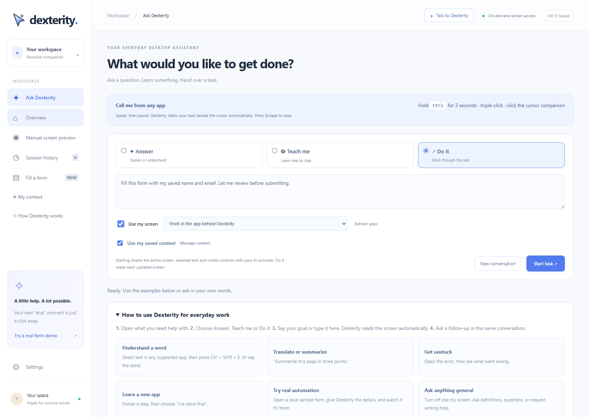
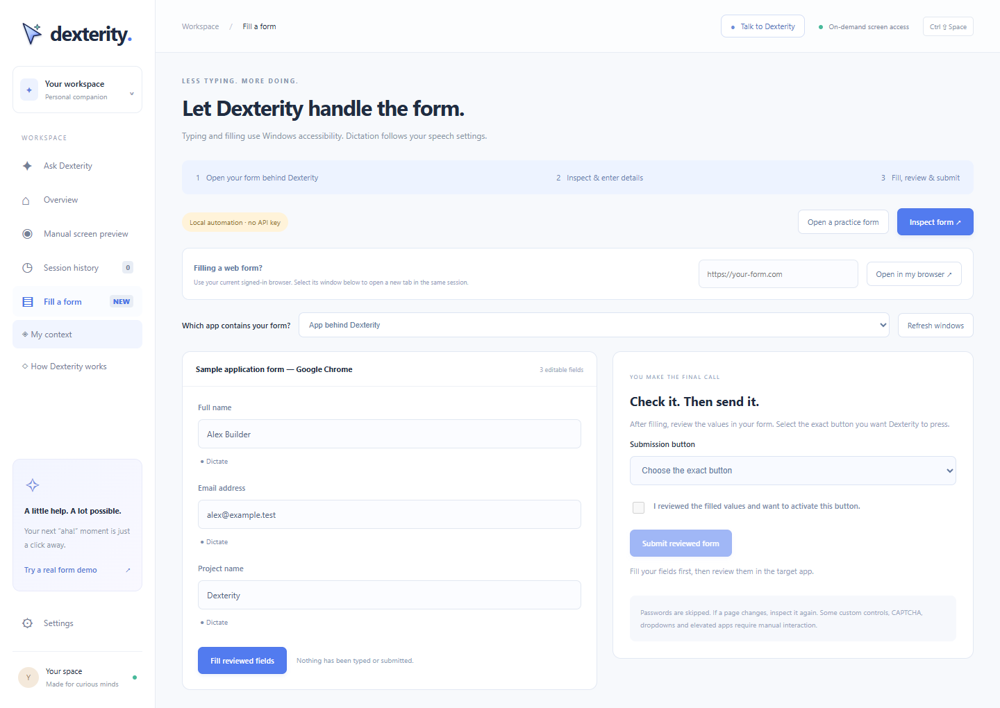
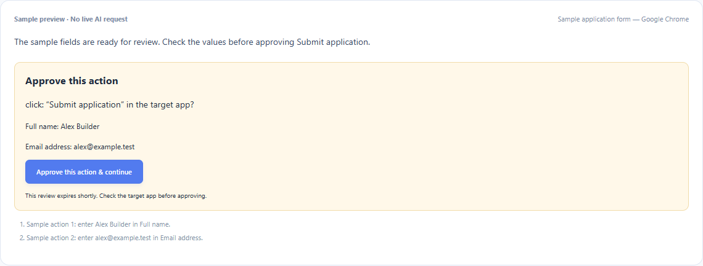
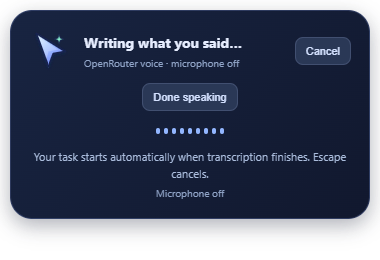
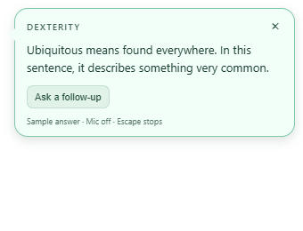
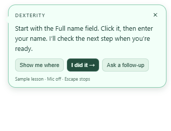
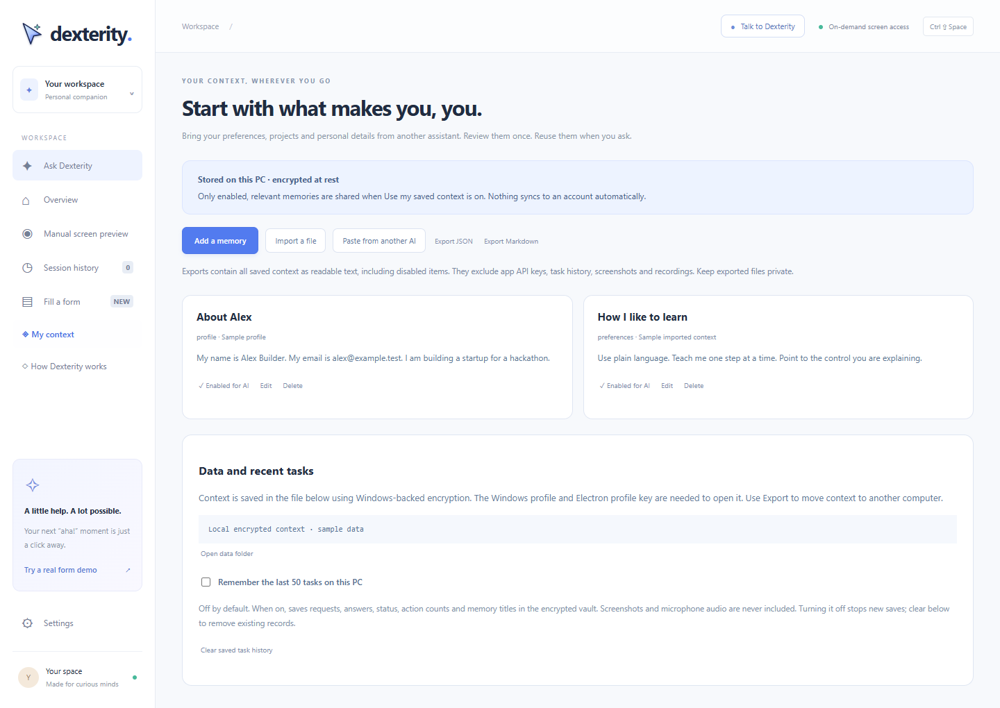
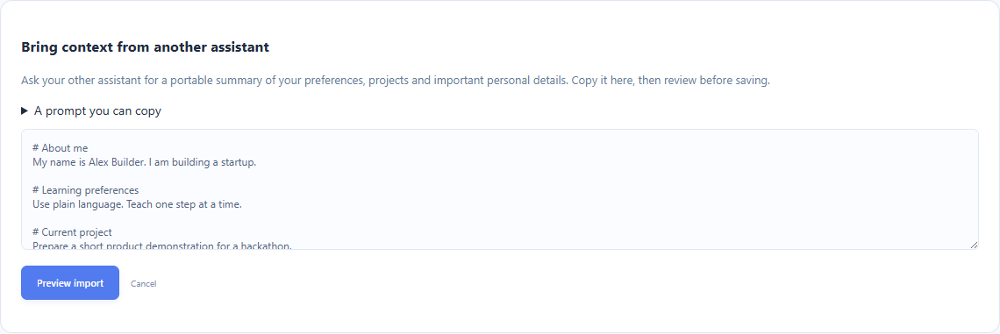

# Dexterity product gallery

[README](../README.md) · [Demo walkthrough](../DEMO.md) · [Architecture](../ARCHITECTURE.md)

Nine views of the current product interface. These screenshots use **fictional sample data and simulated UI events** in a browser renderer. No desktop task, live AI request, microphone recording or external form submission ran while producing them. The [Windows launch status](WINDOWS.md) remains separate from these design previews.

## 01 · Your workspace

Choose Answer, Teach me or Do it. Screen access and saved context are visible options on the request.

## 02 · The form assistant

Select your existing browser window and inspect supported fields. The sample shows a name, email and project ready to fill.

## 03 · Review before submission

The approval surface shows the exact control and field values, with the attempted actions underneath. This is a simulated approval state, not evidence of a submitted application.

## 04 · A short voice request

The transcription card shows when the microphone is off and how to cancel. Voice tasks start automatically after transcription.

## 05 · Understand a word

Highlight text in a supported app and press **Ctrl + Shift + E**. The answer appears in a compact companion bubble.

## 06 · Learn the next step

The teaching card offers one instruction, **Show me where**, **I did it**, and a voice follow-up. A marker depends on the model providing a valid visible target.

## 07 · Keep useful context

Review and enable facts or preferences for relevant requests. This preview uses a fictional Alex Builder profile.

## 08 · Bring context from another AI

Paste text or Markdown, preview it, then select what to keep. Importing a file or summary does not connect to another AI account.

## 09 · See how the team works

Four roles share the goal. A single operator requests desktop actions, and a separate verifier checks the result.

To regenerate these documentation previews from the repository, run `node scripts/screenshots-docs.cjs` with dependencies installed and Chrome available. The script does not launch the desktop EXE.
